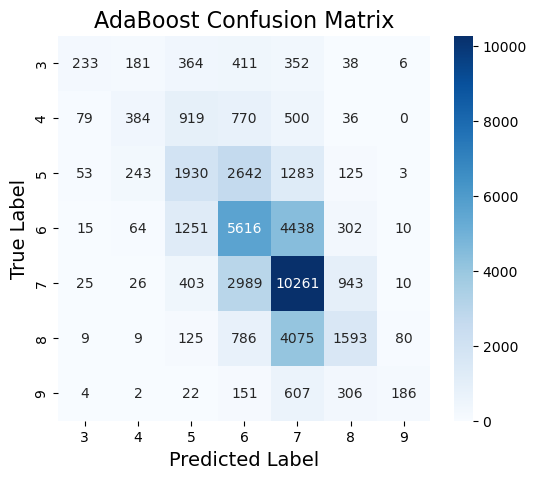
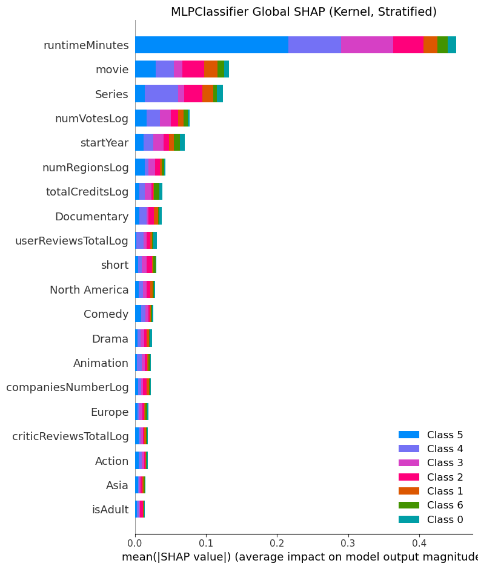

# Predicting IMDb Ratings: Classification, Explainability and Time Series

A data-mining pipeline over 149,531 IMDb titles: preprocessing and outlier detection,
imbalanced learning across four targets, eleven classifiers on a seven-class rating
target, black-box explanation of their failures, and thirty time-series classifiers over
daily revenue trajectories.

[](https://www.python.org/)
[](https://scikit-learn.org/)

## Problem

IMDb publishes a continuous `averageRating` per title and a binned `rating` interval,
`(0, 1]` through `(9, 10]`. The task is to predict the bin from production metadata
alone — runtime, release year, cast and crew counts, genres, region, vote and review
volumes.

`rating` is a perfect binning of `averageRating`: every row's `averageRating` falls
inside its own interval, across all 149,531 rows with zero exceptions. Both are
therefore excluded from the feature set wherever the target derives from `rating`. The
low tail is sparse, so ratings ≤ 3 collapse into one class, giving seven:

```
groupedRating ∈ {≤3, 4, 5, 6, 7, 8, 9}
```

32.7% of the test set is class 7, so a model that predicts nothing but class 7 already
scores 0.3267 — which is the number every result here has to be read against.

## Data

| | |
|---|---|
| **Source** | IMDb title metadata, 149,531 rows × 32 columns (`data/raw/imdb.csv`) |
| **Time series** | 1,134 titles × 51 daily revenue points (`data/raw/imdb_ts.csv`) |
| **Split** | 70/30 by title (`GroupShuffleSplit` on `originalTitle`), `random_state=42` |
| **Missing** | `runtimeMinutes` absent in 26.88% of rows (40,195), k-NN imputed |
| **Columns** | [`data/raw/column_descriptions.md`](data/raw/column_descriptions.md) |

Three processed tabular variants ship with the repo:

| Variant | Contents | Written by | Read by |
|---|---|---|---|
| `tabular/` | the full train and test tables | notebook `00` | `01a`–`01c`, `02`, `03` |
| `tabular_no_outliers/` | the same test set; outliers removed from train only | notebook `00` | `01a`–`01c` |
| `tabular_title_type/` | a separate preprocessing run | shipped as data | `01d` |

## Methods

| Notebook | Task |
|---|---|
| [`00`](notebooks/00_preprocessing_and_outlier_detection.ipynb) | Preprocessing, imputation, outlier detection |
| [`01a`](notebooks/01a_imbalanced_grouped_rating_binary.ipynb) | `groupedRating`, binary — 10 rebalancing strategies × 2 variants |
| [`01b`](notebooks/01b_imbalanced_grouped_rating_multiclass.ipynb) | `groupedRating`, 7-class — as above |
| [`01c`](notebooks/01c_imbalanced_is_adult.ipynb) | `isAdult` — as above |
| [`01d`](notebooks/01d_imbalanced_title_type.ipynb) | `groupedTitleType`, 4-class — as above, plus SMOTEENN |
| [`02`](notebooks/02_advanced_classification.ipynb) | `groupedRating`, 7-class — 11 classifiers |
| [`03`](notebooks/03_explainable_ai.ipynb) | Explaining 4 black boxes on their worst errors |
| [`04`](notebooks/04_time_series_classification.ipynb) | Revenue trajectories — ~30 classifiers |
| [`05`](notebooks/05_sequential_pattern_mining.ipynb) | Sequential pattern mining on discretised series |

### Full method inventory

**Preprocessing and feature engineering**
- Constant- and near-constant column removal
- `titleType` grouping into four classes
- `countryOfOrigin` → region mapping
- Interval-label parsing (`(7, 8]` → ordinal 7)
- Rating grouping to seven classes and binarisation at ≤ 3
- Skewness test (`scipy.stats.skew`, cut-off 2.0) driving `log1p` transformation
- Genre one-hot encoding with rare-category pooling
- Title-type and region one-hot encoding
- Min–max scaling
- Standardisation
- Principal component analysis
- Group-aware train/test splitting by title (`GroupShuffleSplit`)
- Random and stratified train/test splitting (80/20, 75/25)
- K-fold, stratified k-fold, repeated stratified k-fold and stratified shuffle-split cross-validation

**Missing-value imputation**
- k-nearest-neighbours regression imputation of `runtimeMinutes`
- Decision-tree regression imputation (compared against)
- Randomised search over imputer hyperparameters
- MAE, MSE and R² imputer scoring

**Outlier detection**
- Isolation Forest (`pyod`)
- Histogram-based outlier score, HBOS (`pyod`)
- Rank-agreement comparison of the two score distributions

**Imbalanced and synthetic data handling**
- Random undersampling
- Random oversampling
- Tomek links
- Edited nearest neighbours
- Condensed nearest neighbours
- Cluster centroids (MiniBatchKMeans)
- SMOTE
- ADASYN
- SMOTEENN
- Balanced class weights
- Manually specified class weights
- Per-class decision-threshold adjustment

**Classification models**
- Decision tree
- Logistic regression
- LinearSVC
- k-nearest neighbours
- Multi-layer perceptron (128, 64, 32)
- Random forest
- Bagging over decision trees
- AdaBoost
- Gradient boosting
- Histogram gradient boosting
- XGBoost
- LightGBM
- CatBoost
- Probability calibration (`CalibratedClassifierCV`)

**Model selection and feature importance**
- Randomised search with cross-validation
- Optuna hyperparameter optimisation
- Sequential feature selection
- Mean decrease in impurity

**Explainable AI**
- SHAP kernel explainer with k-means background summarisation
- SHAP summary plots
- LIME tabular explanations
- LORE local rule extraction (`xailib`)
- Counterfactual rules from LORE
- Counterfactual explanations via FAT-Forensics

**Time-series representation and feature extraction**
- Nested-panel and 3-D array conversion (`sktime`)
- Catch22 canonical features
- TSFresh feature extraction
- SAX symbolic discretisation
- SFA symbolic Fourier approximation
- Random shapelet transform
- ROCKET and MiniRocket kernel transforms

**Time-series classifiers**
- k-NN with dynamic time warping and with Euclidean distance
- Proximity tree
- Canonical interval forest
- DrCIF
- Time series forest
- Shapelet transform classifier
- Learning shapelets
- RDST (`aeon`)
- MrSEQL
- Individual BOSS and BOSS ensemble
- WEASEL and WEASEL v2
- MUSE
- CNN
- Simple RNN
- LSTM (Keras via scikeras)
- ResNet
- InceptionTime
- LSTM-FCN
- TapNet
- ROCKET classifier and ROCKET + k-NN pipeline
- MultiRocket-Hydra (`aeon`)
- HIVE-COTE v2
- Decision tree, random forest, AdaBoost, histogram gradient boosting, logistic regression and MLP over extracted features

**Sequential pattern mining**
- SAX discretisation (`sktime`)
- Manual z-normalisation, piecewise aggregate approximation and Gaussian quantile breakpoints
- Generalized Sequential Patterns (GSP)
- Pattern mining stratified by rating category and by primary genre
- Motif localisation by start day

**Evaluation**
- Precision, recall, F1 and support per class
- Accuracy, macro-F1 and weighted F1
- Confusion matrices
- One-vs-rest ROC curves and AUC
- Majority-class baselines for every target

## Results



*Errors are almost entirely confined to the band around the diagonal: AdaBoost places
85.5% of the 44,860 test titles within one rating point of the truth, against 73.6% for
always predicting class 7. Exact-match accuracy of 0.45 understates the model, and the
classes it never recovers — 3, 4 and 9 — are the three rarest.*

### Seven-class `groupedRating` (notebook 02, n = 44,860)

| Model | Accuracy | Macro F1 | Weighted F1 |
|---|---:|---:|---:|
| **AdaBoost** | **0.45** | **0.34** | **0.43** |
| Bagging | 0.45 | 0.33 | 0.42 |
| Random forest | 0.44 | 0.33 | 0.42 |
| HistGradientBoosting | 0.42 | 0.29 | 0.38 |
| LightGBM | 0.42 | 0.29 | 0.38 |
| XGBoost | 0.41 | 0.30 | 0.39 |
| CatBoost | 0.41 | 0.28 | 0.38 |
| Gradient boosting | 0.40 | 0.23 | 0.34 |
| MLP (128, 64, 32) | 0.38 | 0.26 | 0.37 |
| LinearSVC | 0.35 | 0.19 | 0.32 |
| Logistic regression | 0.35 | 0.19 | 0.32 |
| *baseline: most frequent* | *0.3267* | *0.0704* | *0.1609* |

Tree ensembles gain about 12 points over the baseline; the two linear models gain two.

### What drives a rating



*Kernel SHAP over the MLP, computed on a stratified sample of 350 test rows (50 per
class) and stacked by class. `runtimeMinutes` dominates by a wide margin; the next two
are format flags — `movie` and `Series` — rather than anything about content, and every
genre indicator sits near the bottom of the ranking.*

Mean decrease in impurity on the random forest also puts `runtimeMinutes` first, but its
ranking is flat rather than dominated — `startYear`, `numVotesLog` and `totalCreditsLog`
follow closely — and no genre or title-type column reaches its top ten at all. The two
methods agree on the conclusion and disagree on its sharpness: production scale and era
predict a rating better than what a film is about.

## Project structure

```
notebooks/                 The whole analysis; each notebook is self-contained (9)
  00_preprocessing_and_outlier_detection.ipynb
  01a_imbalanced_grouped_rating_binary.ipynb
  01b_imbalanced_grouped_rating_multiclass.ipynb
  01c_imbalanced_is_adult.ipynb
  01d_imbalanced_title_type.ipynb
  02_advanced_classification.ipynb
  03_explainable_ai.ipynb
  04_time_series_classification.ipynb
  05_sequential_pattern_mining.ipynb
  img/                     318 figures, one directory per notebook
                           → notebooks/img/README.md

data/
  raw/                     imdb.csv, imdb_ts.csv, column_descriptions.md
  processed/               tabular, tabular_no_outliers, tabular_title_type, timeseries

reports/report.pdf         The written report for the course
```

## Setup

Python 3.12.

```bash
pip install -r requirements.txt
cp .env.example .env          # only for notebook 04's OMDb section
jupyter lab notebooks/
```

`requirements.txt` pins only what the notebooks' own warning output proves —
scikit-learn 1.6.x and pandas ≥ 2.1. The rest are unpinned and marked, `sktime` above
all: several of the estimators used here moved or were removed across its minor
releases, and a wrong pin fails at import.

## Reproducing

Run [`00`](notebooks/00_preprocessing_and_outlier_detection.ipynb) first — it reads
`data/raw/imdb.csv` and writes `data/processed/tabular/` and
`data/processed/tabular_no_outliers/`. The other eight are independent of each other and
can be run in any order afterwards.

Two inputs are shipped rather than generated: `data/processed/tabular_title_type/`
(a separate preprocessing run, read only by `01d`) and `data/processed/timeseries/`,
built from the OMDb daily-revenue pulls behind `data/raw/imdb_ts.csv`. That directory
holds three variants — `preprocessed_no_augmentation.csv` feeds `04`,
`preprocessed.csv` feeds `05`, and `preprocessed_deseasonalized.csv` is a
trend-only variant kept for reference, which no notebook reads.

Every path in every notebook is relative to `notebooks/`, so start Jupyter there. The
two heaviest cells in the project are HIVE-COTE v2 and MultiRocket-Hydra at the end of
`04`; budget hours, not minutes.

## Credits

Course project for **Data Mining 2**, MSc in Data Science & Business Informatics,
University of Pisa, A.Y. 2024-2025.

Report in [`reports/report.pdf`](reports/report.pdf).

*Authors*: Alessandro Falcetta and Riccardo Roselli.